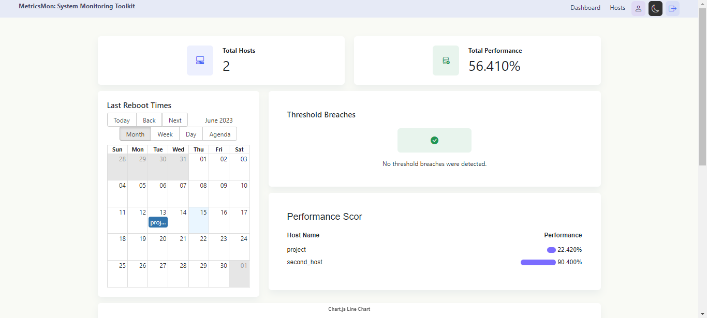
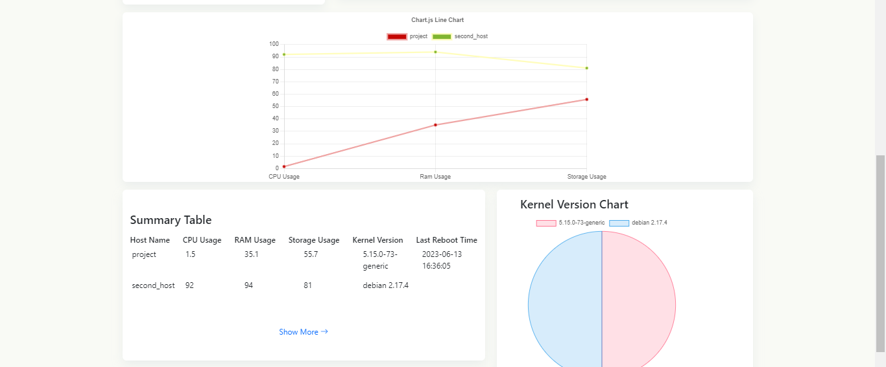
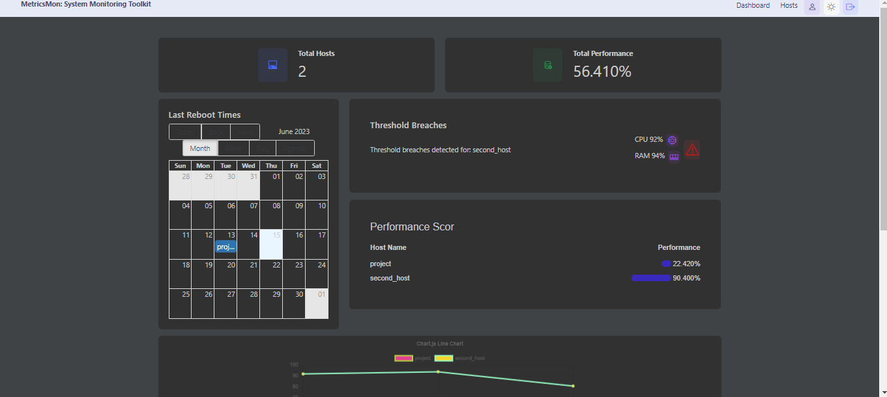

# MetricsMon: System Monitoring Toolkit

A system monitoring toolkit where you can manage the performance of computer systems.

## Table of contents

- [Overview](#overview)
  - [The app](#the-app)
  - [Screenshot](#screenshot)
  - [Built with](#built-with)
  - [Used Features](#used-features)
- [Author](#author)

## Overview

### The app

Users should be able to:

- View the optimal layout depending on their device's screen size
- They can login and logout.
- Initially, they can see summary of performances 
- They can see data in many different visual ways (graphs, charts etc)
- They can examine the detailed information of the hosts returned from the database.
- They can send command and see the result.
- They can adjust the theme to light or dark.

### Screenshot

### Built with

- React.JS
- CSS custom properties
- Redux 
- Redux Toolkit
 

### Used Features
- useState
- useEffect
- useSelector
- useDispatch
- configureStore
- createSlice
- REST API
- configureStore
- createSlice
- createAsyncThunk

## Author

- LinkedIn - [Damla Kara](https://www.linkedin.com/in/damla-kara-348081232/)